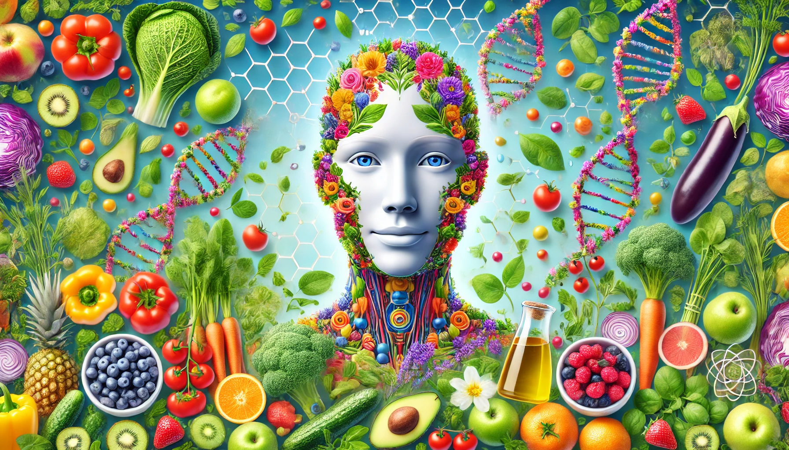
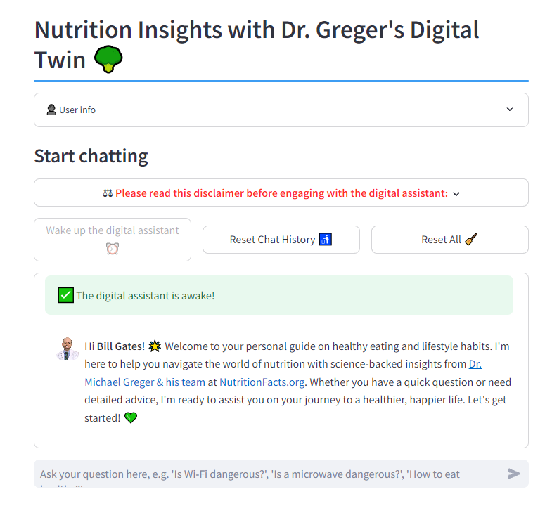

<!---

--->

<!--- BADGES: START --->

<!--- BADGES: END --->

# 🥦 Nutrify Your Life 🥦

## Un Compañero de Salud y Estilo de Vida Basado en la Ciencia

### (un chatbot de preguntas y respuestas basado en RAG)

**Nutrify Your Life** es tu compañero personal, inspirado en la experiencia basada en la ciencia de [NutritionFacts.org](https://nutritionfacts.org/about/). Diseñado para responder tus preguntas sobre alimentación saludable y hábitos de vida, este asistente digital impulsado por IA se basa en más de 1.200 artículos de blog rigurosamente investigados desde 2011. Ya sea que busques consejos de nutrición o orientación para llevar una vida más saludable, ofrece información confiable respaldada por la ciencia para ayudarte a vivir una vida más saludable e informada.

Comienza a chatear con el compañero **Nutrify Your Life** [aquí](https://nutrify-your-life.streamlit.app/).

<!---

  

    

--->

### Video de demostración de la aplicación

[Nutrify_Your_Life_Demo](https://github.com/user-attachments/assets/de4cd419-4188-483b-b373-d3ac6cc09f76)

## Documentación

- [Cómo puedes ejecutar y probar el chatbot tú mismo](docs/offical_how_to_run_yourself.md)
- [Cómo construí y evalué este chatbot](docs/offical_how_i_build_it.md)
- [Evaluación del proyecto personal](docs/internal_project_evaluation.md) basada en los [criterios](https://github.com/DataTalksClub/llm-zoomcamp/blob/main/project.md#evaluation-criteria) del curso [LLM-zoomcamp](https://github.com/DataTalksClub/llm-zoomcamp)
- [Conjunto de datos utilizado para construir el chatbot](#dataset)
- [Tecnologías utilizadas](#technologies)

## Conjunto de Datos

Los datos crudos utilizados para construir la base de conocimientos RAG se almacenan en `data/blog_posts/json`. Consta de todos los artículos del blog de [https://nutritionfacts.org/blog/](https://nutritionfacts.org/blog/) (a fecha de 28.08.2024). Consulta el cuaderno `notebooks/web_scraping.ipynb` para obtener más detalles técnicos sobre el proceso de extracción web (web scraping).

<!---
## Help improve the bot

- setup "Developer Environment"
  - `pip install --no-cache-dir -e .[dev]`
  - pre-commit setup: `pre-commit install`
    - test: `pre-commit run --all-files`
--->

## Tecnologías

El chatbot se construyó con las siguientes tecnologías:

- Web Scraping: [Librería Beautiful Soup](https://www.crummy.com/software/BeautifulSoup/)

- Embeddings de texto: modelo preentrenado [`multi-qa-MiniLM-L6-cos-v1`](https://huggingface.co/sentence-transformers/multi-qa-MiniLM-L6-cos-v1) de la [Librería Sentence Transformers](https://www.sbert.net/index.html)
  - Construido con [PyTorch](https://pytorch.org/get-started/locally/) y la [Librería Transformers](https://github.com/huggingface/transformers) de [Huggingface](https://huggingface.co/)
  - Fue "optimizado para búsqueda semántica: Dada una consulta/pregunta, puede encontrar fragmentos relevantes. Fue entrenado en un conjunto grande y diverso de pares (pregunta, respuesta)."

- Almacén Vectorial (también conocido como Base de Conocimientos de RAG): [Librería LanceDB](https://lancedb.github.io/lancedb/)

- Recuperación de Información (IR):
  - Búsqueda de texto completo (también conocida como búsqueda por palabras clave): [Librería Tantivy](https://github.com/quickwit-oss/tantivy) (basada en BM25) ([Doc de LanceDB](https://lancedb.github.io/lancedb/fts/)).
  - Búsqueda Vectorial (también conocida como búsqueda de vecinos más cercanos) Métrica: Similitud del Coseno ([Doc de LanceDB](https://lancedb.github.io/lancedb/search/)).
  - Reranqueador: Reranqueador de Combinación Lineal con un 30% para Búsqueda Vectorial ([Doc de LanceDB](https://lancedb.github.io/lancedb/reranking/linear_combination/)).

- API de LLM: [Groq Cloud](https://groq.com/) (plan gratuito)
  - [Lista de modelos de Groq](https://console.groq.com/docs/models)

- Aplicación Web: [Librería Streamlit](https://streamlit.io/)
- Despliegue: [Streamlit Cloud](https://streamlit.io/cloud) (plan gratuito)

- Base de datos para datos de usuario: [MongoDB](https://www.mongodb.com/)
