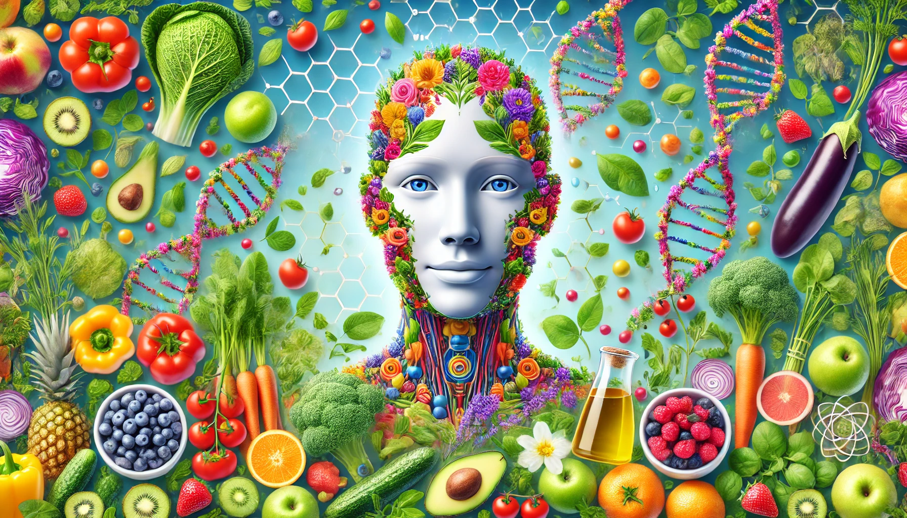
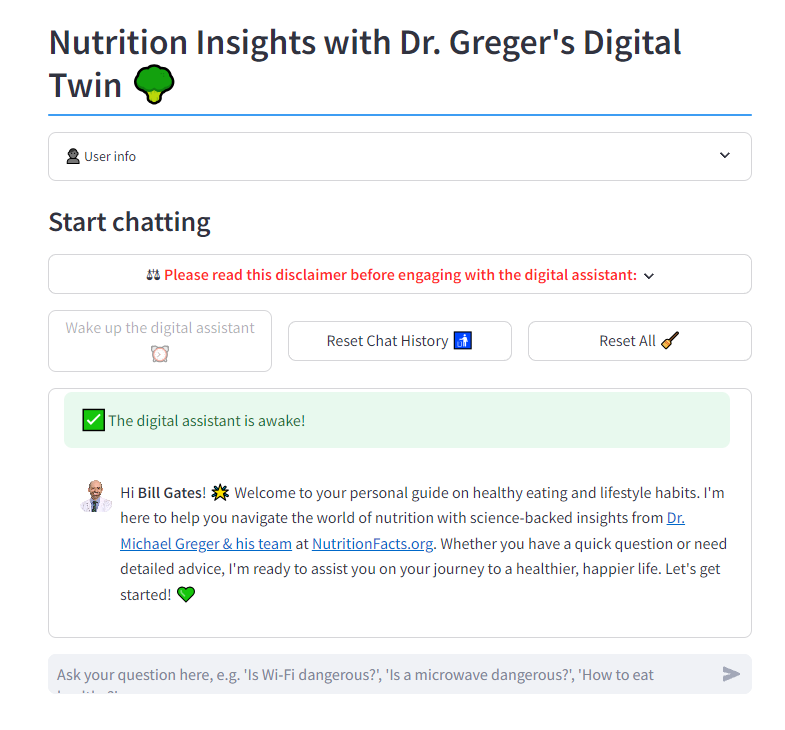

<!--- BADGES: START --->

<!--- BADGES: END --->

# Nutrify Your Life: A Science-Based Health & Lifestyle Companion 🥦

## A RAG-based Q&A chatbot

**Nutrify Your Life** is your personal digital assistant, inspired by the science-based expertise of [NutritionFacts.org](https://nutritionfacts.org/about/). Designed to answer your questions about healthy eating and lifestyle choices, this assistant draws from over 1,200 well-researched blog posts since 2011. Whether you're looking for nutrition tips or guidance on living a healthier life, it offers reliable, science-backed insights to help you live a healthier, more informed life.

Start chatting with the **Nutrify Your Life** companion [here](https://dr-greger-blog-bot.streamlit.app/).

<!---

  

    

--->

### Demo Video

[App Demo Video](https://github.com/user-attachments/assets/ac50bd6c-dd41-4d10-82b3-c6b5f01526ab)

## Documentation

- [How you can run & test the chatbot yourself](docs/offical_how_to_run_yourself.md)
- [How I built and evaluated this chatbot](docs/offical_how_i_build_it.md)
- [Personal project evaluation](docs/internal_project_evaluation.md) based on the [criteria](https://github.com/DataTalksClub/llm-zoomcamp/blob/main/project.md#evaluation-criteria) of the [LLM-zoomcamp](https://github.com/DataTalksClub/llm-zoomcamp) course
- [Dataset used to build the chatbot](#dataset)
- [Technologies used](#technologies)

## Dataset

The raw data used to build the RAG knowledge base is stored in `data/blog_posts/json`. It consists of all blog posts from [https://nutritionfacts.org/blog/](https://nutritionfacts.org/blog/) (as of 28.08.2024). See the `notebooks/web_scraping.ipynb` notebook for more technical details on the web scraping process.

<!---
## Help improve the bot

- setup "Developer Environment"
  - `pip install --no-cache-dir -e .[dev]`
  - pre-commit setup: `pre-commit install`
    - test: `pre-commit run --all-files`
--->

## Technologies

The chatbot was build with the following technologies:

- Web Scraping: [Beautiful Soup Library](https://www.crummy.com/software/BeautifulSoup/)

- Text embeddings: pre-trained model [`multi-qa-MiniLM-L6-cos-v1`](https://huggingface.co/sentence-transformers/multi-qa-MiniLM-L6-cos-v1) of the [Sentence Transformers Library](https://www.sbert.net/index.html)
  - build with [PyTorch](https://pytorch.org/get-started/locally/) and [Huggingface](https://huggingface.co/)'s [Transformers Library](https://github.com/huggingface/transformers)
  - It was "tuned for semantic search: Given a query/question, it can find relevant passages. It was trained on a large and diverse set of (question, answer) pairs."

- Vector Store (aka Knowledge Base of RAG): [LanceDB Library](https://lancedb.github.io/lancedb/)

- Information Retrieval (IR):
  - Full-text search (aka Keyword-Search): [Tantivy Library](https://github.com/quickwit-oss/tantivy) (based on BM25) ([LanceDB Doc](https://lancedb.github.io/lancedb/fts/)).
  - Vector Search (aka Search for nearest neighbors) Metric: Cosine Similarity ([LanceDB Doc](https://lancedb.github.io/lancedb/search/)).
  - Reranker: Linear Combination Reranker with 30% for Vector Search ([LanceDB Doc](https://lancedb.github.io/lancedb/reranking/linear_combination/)).

- LLM API: [Groq Cloud](https://groq.com/) (free tier)
  - [List of Groq's Models](https://console.groq.com/docs/models)

- Web App: [Streamlit Library](https://streamlit.io/)
- Deployment: [Streamlit Cloud](https://streamlit.io/cloud) (free tier)

- Database for User Data: [MongoDB](https://www.mongodb.com/)
