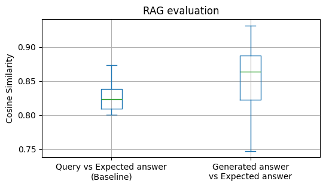

# Nutrition Insights with Dr. Greger's Digital Twin 🥦 (a RAG-based Q&A chatbot)

This digital assistant, inspired by [Dr. Michael Greger & his team](https://nutritionfacts.org/team/) at [NutritionFacts.org](https://nutritionfacts.org/about/), was created to answer user questions about healthy eating and lifestyle choices. Drawing from [over 1,200 well-researched blog posts since 2011](https://nutritionfacts.org/blog/), it provides science-backed insights to help users live a healthier, more informed life.

Start chatting with Dr. Greger's Digital Twin [here](https://dr-greger-blog-bot.streamlit.app/).

## Problem statement

- [What kind of problems does this digital assistant help mitigate?](docs/project_description.md)

## Dataset (aka RAG knowledge base)

The raw data used to build the RAG knowledge base is stored in `data/blog_posts/json`. It consists of all blog posts from [https://nutritionfacts.org/blog/](https://nutritionfacts.org/blog/) (as of 28.08.2024). See the `notebooks/web_scraping.ipynb` notebook for more technical details on the web scraping process.

The data was automatically ingested into a vector store located in `databases/my_lancedb/` using the [LanceDB Library](https://lancedb.github.io/lancedb/) and the Python script `src/ingestion.py`. The text chunk where enriched with following meta data:

```python
# Meta Data of the text chunk of a blog post
"hash_doc": str,  # Unique ID of text chunk (as a hash of url + title + text)
"rank_abs": int,  # Rank of the text chunk in the blog post
"rank_rel": float,  # Relative rank of the text chunk in the blog post
"tags_doc": str,  # Tags of "tags_all" that exists in the text chunk
"n_tags_doc": int,  # Number of matching tags in the text chunk
"n_words_doc": int,  # Number of words in the text chunk
"n_char_doc": int,  # Number of characters in the text chunk
"sim_doc_title": float,  # Similarity between the text chunk and the title
"sim_doc_tags": float,  # Similarity between the text chunk and the tags
# Meta Data of the blog post (same value for its all text chunks)
"title": str,  # Title of blog post
"url": str,  # URL of blog post
"tags_all": str,  # Tags of blog post
"hash_title": str,  # Unique ID of blog post (as a hash of the url + title)
"n_docs": int,  # Number of text chunks in the blog post (after chunking)
```

## Information Retrieval (IR)

**Embeddings**: To take advantage of the vector search, the text was embedded using the pre-trained model [`multi-qa-MiniLM-L6-cos-v1`](https://huggingface.co/sentence-transformers/multi-qa-MiniLM-L6-cos-v1) from the [Sentence Transformers Library](https://www.sbert.net/index.html), as it is tuned for Q&A chatbots.

**Retriever**: Based on the retrieval evaluation results (see section below), a hybrid of vector and full-text search with the [Reciprocal Rank Fusion](https://lancedb.github.io/lancedb/reranking/rrf/) reranker was used a retriever of text chunks.

**Post-processing**: The top 10 retrieved text chunks are further processed and enriched with metadata: They are grouped by their blog post title, and the groups are ordered by the sum of the chunks' relevance scores from the retriever. Finally, the blog post URL is added to each group.

### Ideas for improvement

- if similar blog post title (cosine similarity > 0.8), prioritize the more recent one (unless the from the same year)
- also provide the chunk before and after the retrieve chunk from the same blog post for enrichment

## Evaluation

### Strategy & Ground Truth

We need a user query - text chunk mapping, where we know that the text chunk is relevant to the user query. To make it easy for me, I used the titles of the blog posts as user queries. I then performed the following evaluations:

- For the retrieval, I measured whether a text chunk from the blog post with the same title was retrieved among the top results using various metrics.
- For the RAG flow, I measured the cosine similarity between the answer generated by the LLM and the most relevant text chunk from the blog post with respect to the title (aka the text chunk from the blog post with the same title that has the highest similarity score to the title).

This simple approach has two obvious caveats (but possibly more):

1. A text chunk from a blog post with a completely different title may be more relevant to the user's query. Therefore, my current retrieval evaluation is biased towards finding the text chunk that has the most relevant title, but not necessarily the most relevant information for a user query.

2. Blog posts can have semantically very similar titles.

I mitigated the second point by grouping blog posts with semantically similar titles.
To do this, I computed the cosine similarity between all titles and grouped titles with a cosine similarity `> 0.8` together.
The list of title hashes for each group is stored in the file `data/ground_truth/eva_title_groups.csv`.
During retrieval evaluation, if a title from a group is used as a user query, then a retrieved text chunk with a title from the same group will also be considered relevant.

The ground truth table was created with the  `notebooks/evaluation_retrieval.ipynb` notebook and was stored in `data/ground_truth/eva_ground_truth.csv`.
It has 5 columns:

- Blog post title, which serves as the user query.
- The hash of the title itself, for easy lookup in the database.
- The list of title hashes that belong to the same group, where the collective cosine similarity is > 0.8.
- The hash of the most relevant text chunk (i.e. the text chunk from the blog post that has the highest similarity to the title).
- The cosine similarity between the title and the most relevant text chunk.

1248 of 1281 titles were included in the ground truth table, after filtering out titles that were about self-advertisement.
There are 65 groups in the ground truth table, where the collective cosine similarity is > 0.8.

### Retrieval Performance

The evaluation was done with the `notebooks/evaluation_retrieval.ipynb` notebook.
See it for more technical details.

#### Test results

With the ground truth table, different types of retrievers were evaluated using the Hit Rate and Mean Reciprocal Rank (mrr) as metrics.
Below are the result sorted by Hit Rate.

```test
retrievers     hit_rate       mrr
---------------------------------
rrf            0.843750  1.159802
hybrid         0.841346  1.138715
lc_weight_0.7  0.841346  1.138715
lc_weight_0.3  0.841346  1.138715
fts            0.818910  0.947983
vector         0.809295  1.054688
```

_(For details on the different types of retrievers, see the `notebooks/evaluation_retrieval.ipynb` notebook.)_

The retriever `rrf`, a hybrid of vector and full-text search with the [Reciprocal Rank Fusion](https://lancedb.github.io/lancedb/reranking/rrf/) as reranker, delivered the highest score and was finally selected.

It is interesting to note that pure vector search (`vector`) performed worse than pure full-text search (`fts`, aka keyword search), and that both performed worse than any hybrid search.

Due to the limitation of available resources, not [all available rerankers from the LanceDB Library](https://lancedb.github.io/lancedb/reranking/) could be evaluated.
Excluded from the evaluation were following rerankers:

- [Cohere](https://lancedb.github.io/lancedb/reranking/cohere/) due to a too low rate limit in free tier
- [Cross Encoder](https://lancedb.github.io/lancedb/reranking/cross_encoder/) due to being too slow when using CPU as engine
- [ColBERT](https://lancedb.github.io/lancedb/reranking/colbert/) due to being too slow when using CPU as engine

### RAG Performance

The evaluation was done with the `notebooks/evaluation_rag.ipynb` notebook.
See it for more technical details.

#### Test Setup

For this evaluation, only titles where the most relevant text chunk has a cosine similarity of `>0.8` with the title were used as ground truth. This made the evaluation more robust by ensuring that each title/query actually has a relevant chunk of text that the LLM should reproduce. This also made the evaluation more manageable in terms of time, since the evaluation can take quite a long time (e.g. ~1 min per answer generated), given the free tier of the LLM API provider was used.

This restriction reduces the number of available titles/queries to 77. The cosine similarity between these titles and their most relevant text chunk is on average: `0.83+-0.02`. This is our baseline score for the RAG flow. For the RAG to be considered functional, it should achieve this score.

#### Test results

The complete results of the evaluation are stored in `data/ground_truth/eva_rag_results.json` with the title/query itself, the retrieved context, the LLM answer, and the cosine similarity score between the LLM answer and the most relevant text chunk. Index is the hash of the most relevant text chunk.
In `data/ground_truth/eva_rag_similarity.csv` only the hash of the most relevant text chunk and the similarity score are stored.
Using this file, we can calculate an average similarity score between the expected and the generated answer of `0.85+-0.04`, which agrees with our baseline score of `0.83+-0.02` (see figure below).
Therefore, we can conclude from this evaluation that the RAG flow is able to produce useful results when the user query is covered by the RAG knowledge base. 🥳



## Use the chatbot

### In the cloud (aka deployed)

- got to the streamlit app [here](https://dr-greger-blog-bot.streamlit.app/).
- the corresponding dashboard for monitoring the app usage is [here](https://chatbotdrgreger.grafana.net/public-dashboards/1ae4a1c3c47c41478e16d97aaa5a2276).

    > [!IMPORTANT]
    > The online dashboard will stop working properly (aka won't show any data) on 18.09.2024 due to the 14-day trial period ending by Grafana. 😭
  - I'm using a MongoDB plugin that is only available for the Enterprise version of Grafana. Unfortunately, I found this out only after setting up my own MongoDB and creating the dashboard. 😒
  - I tried to rebuild it using MongoDB's own dashboard tool "Charts". See the result [here](https://charts.mongodb.com/charts-project-0-dwgewmy/public/dashboards/10ed0c93-9fb1-4b89-a1e3-966fddef4f27). However, I was only able to reproduce the simplest panels. Moreover, I couldn't figure out to set up a time filter as in Grafana. 😓

### Run it on your own

- add a [Groq API key](https://console.groq.com/keys) in `.streamlit/secrets.toml` as `GROQ_TOKEN = "..."` (since the app is using [Groq Cloud](https://groq.com/) as my LLM API provider, as it is free tier).

> [!NOTE]
> There is no local dashboard to monitor the app usage, since Grafana doesn't offer the MongoDB data plugin for the free tier. [Source](https://grafana.com/docs/grafana/latest/introduction/grafana-enterprise/#enterprise-data-sources) (see comment above for the deployed version)

#### In a container (using docker)

- ensure docker exists: `docker version`
- ensure docker compose exists: `docker compose version`, if not then [install it](https://docs.docker.com/compose/install/linux/)

- using Docker Compose:
  - build & run containers: `docker compose up --build`
  - view app in the browser via this url: <http://localhost:8501>

- for developers: using the Dockerfile of the app:
  - start server for the user database: `docker-compose --file docker-mongodb.yml up -d`
  - build app container: `docker build -t app:latest .`
  - run app container: `docker run -p 8501:8501 app:latest`
  - view app in the browser via this url: <http://localhost:8501>

#### From the source code

- clone this repository: `git clone https://github.com/alexkolo/rag_nutrition_facts_blog`

- get right Python version
  - it was build with version `3.12.3`
  - setup suggestions using `pyenv`:

    ```bash
    pyenv install 3.12.x
    pyenv global 3.12.x
    ```

    - [install `pyenv` on Linux or MacOS](https://github.com/pyenv/pyenv)
    - [install `pyenv` on Windows](https://github.com/pyenv-win/pyenv-win)

- setup "User Environment":
  - for Linux or MacOS:

    ```bash
    # assumes Python version 3.12.x
    python -m venv venv  # removed via: sudo rm -rf venv
    source venv/bin/activate
    bash setup.sh
    ```

  - for Windows:

    ```powershell
    # assumes Python version 3.12.x
    python -m venv venv
    .\venv\Scripts\Activate
    Set-ExecutionPolicy -ExecutionPolicy RemoteSigned -Scope Process
    .\setup.ps1
    ```

- start server for the user database: `docker-compose --file docker-mongodb.yml up -d`
- start the app via `streamlit run app.py`
- view it in the browser via this url: <http://localhost:8501>

## Help improve the bot

- setup "Developer Environment"
  - `pip install --no-cache-dir -e .[dev]`
  - pre-commit setup: `pre-commit install`
    - test: `pre-commit run --all-files`

## Technologies

The chatbot was build with the following technologies:

- Web Scraping: [Beautiful Soup Library](https://www.crummy.com/software/BeautifulSoup/)

- Text embeddings: pre-trained model [`multi-qa-MiniLM-L6-cos-v1`](https://huggingface.co/sentence-transformers/multi-qa-MiniLM-L6-cos-v1) of the [Sentence Transformers Library](https://www.sbert.net/index.html)
  - build with [PyTorch](https://pytorch.org/get-started/locally/) and [Huggingface](https://huggingface.co/)'s [Transformers Library](https://github.com/huggingface/transformers)
  - It was "tuned for semantic search: Given a query/question, it can find relevant passages. It was trained on a large and diverse set of (question, answer) pairs."

- Vector Store (aka Knowledge Base of RAG): [LanceDB Library](https://lancedb.github.io/lancedb/)

- Information Retrieval (IR):
  - Full-text search (aka Keyword-Search): [Tantivy Library](https://github.com/quickwit-oss/tantivy) (based on BM25) ([LanceDB Doc](https://lancedb.github.io/lancedb/fts/)).
  - Vector Search (aka Search for nearest neighbors) Metric: Cosine Similarity ([LanceDB Doc](https://lancedb.github.io/lancedb/search/)).
  - Reranker: Linear Combination Reranker with 30% for Vector Search ([LanceDB Doc](https://lancedb.github.io/lancedb/reranking/linear_combination/)).

- LLM API: [Groq Cloud](https://groq.com/) (free tier)
  - [List of Groq's Models](https://console.groq.com/docs/models)

- Web App: [Streamlit Library](https://streamlit.io/)
- Deployment: [Streamlit Cloud](https://streamlit.io/cloud) (free tier)

- Database for User Data: [MongoDB](https://www.mongodb.com/)
