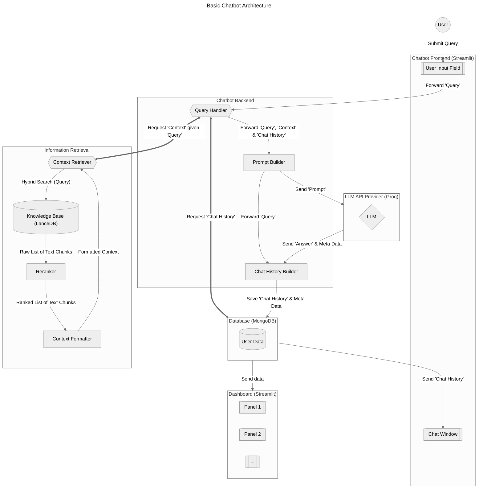

# How I built and evaluated this chatbot

TODO: show image of the basic architecture

## Basic Chatbot Architecture

_A simplified version of the chatbot architecture:_



## Knowledge base

### **Ingestion**

The dataset was automatically ingested into a vector store located in `databases/my_lancedb/` using the [LanceDB Library](https://lancedb.github.io/lancedb/) and the Python script `src/ingestion.py`. The text chunk where enriched with following meta data:

  ```python
  # Meta Data of the text chunk of a blog post
  "hash_doc": str,  # Unique ID of text chunk (as a hash of url + title + text)
  "rank_abs": int,  # Rank of the text chunk in the blog post
  "rank_rel": float,  # Relative rank of the text chunk in the blog post
  "tags_doc": str,  # Tags of "tags_all" that exists in the text chunk
  "n_tags_doc": int,  # Number of matching tags in the text chunk
  "n_words_doc": int,  # Number of words in the text chunk
  "n_char_doc": int,  # Number of characters in the text chunk
  "sim_doc_title": float,  # Similarity between the text chunk and the title
  "sim_doc_tags": float,  # Similarity between the text chunk and the tags
  # Meta Data of the blog post (same value for its all text chunks)
  "title": str,  # Title of blog post
  "url": str,  # URL of blog post
  "tags_all": str,  # Tags of blog post
  "hash_title": str,  # Unique ID of blog post (as a hash of the url + title)
  "n_docs": int,  # Number of text chunks in the blog post (after chunking)
  ```

### **Chunking**

Since the paragraphs were kept separate during web scraping, the blog posts are technically already chunked, but this chunking wasn't very useful because the length of the paragraphs varies greatly. They can be very short, like just a question or statement that is very similar to the query, or super long, exceeding the limits of the embedding model (512 tokens). Neither would be great. So all the paragraphs of a blog post were merged and then recursively chunked using the _industry standard_ for chunk size and overlap of 1000 and 100 characters, respectively (~250 and ~25 tokens). (See `src.chunking.recursive_text_splitter` for technical details.) This setup is also consistent with the embedding model used, which was trained on 250 token texts.

### **Embeddings**

To take advantage of LanceDB's vector search, a text chunk was embedded using the pre-trained model [`multi-qa-MiniLM-L6-cos-v1`](https://huggingface.co/sentence-transformers/multi-qa-MiniLM-L6-cos-v1) from the [Sentence Transformers Library](https://www.sbert.net/index.html), as it is _"tuned for semantic search: Given a query/question, it can find relevant passages. It has been trained on a large and diverse set of (question, answer) pairs"_ ([Ref.](https://www.sbert.net/docs/sentence_transformer/pretrained_models.html)).

LanceDB's vector store has been set up to do the embedding of the text chunks in the background when adding entries, i.e. it does not need to be done beforehand. For me, this was much slower than doing the embedding manually before ([Ref](https://lancedb.github.io/lancedb/embeddings/embedding_functions/)), but this setup was necessary for using the hybrid search ([Ref](https://lancedb.github.io/lancedb/hybrid_search/hybrid_search/)).

The embedding appears as the column `"vector"` (default) in the knowledge base, while the original text chunk is in the column `"text"`.

### **Statistics**

The resulting knowledge base for the RAG consists of 1281 blog posts, each with an average of 5.5 text chunks of ~1000 characters each. That makes a total of 7023 text chunks in the vector store.

## Information Retrieval (IR)

**Retriever**: Based on the retrieval evaluation results (see section below), a hybrid of vector and full-text search with the [Reciprocal Rank Fusion](https://lancedb.github.io/lancedb/reranking/rrf/) reranker was used a retriever of text chunks.

**Post-processing**: The top 10 retrieved text chunks are further processed and enriched with metadata: They are grouped by their blog post title, and the groups are ordered by the sum of the chunks' relevance scores from the retriever. Finally, the blog post URL is added to each group.

### Ideas for improvement

- if similar blog post title (cosine similarity > 0.8), prioritize the more recent one (unless the from the same year)
- sentence-window retrieval: also provide the chunk before and after the retrieve chunk from the same blog post for enrichment
- Query rewriting: try HyDE (let the LLM answer the query hypothetically and use this as the new query)

## Chatbot App

### Chatting

I created a chat experience rather than a simple query/response experience because it feels more natural.
To make this work, the retrieved context from the last user query is fed into the system message at the top of the chat history.
This way, the bot always gets a new system message after each new user query, while also being aware of the previous user queries and bot responses for a given chat session, and being able to take advantage of them.
See `src.llm_api.build_full_llm_chat_input` for more details.

Since a chat history can become too long to handle as input to an LLM, the application keeps track of the token length of the chat history and will block any user request if it reaches a threshold set by the LLM API provider and suggest resetting the chat history.
To keep global token usage low, each user request is limited to 500 characters.

### LLM API Provider

As LLM API provider I used [Groq Cloud](https://groq.com/) because it is free and has a large number of open weight models ([List of Groq's Models](https://console.groq.com/docs/models)).
The application was designed to select a model based on the currently active LLMs offered by Groq and a ranked list of LLMs I created.
Therefore, a user may not always get the same model.

### Interface

I use the [Streamlit Library](https://streamlit.io/), given it's fast and easy to use and it can be deployed for free with the [Streamlit Cloud](https://streamlit.io/cloud) (given some constrains). See `app.py` for details.

## Evaluation

### Strategy & Ground Truth

We need a user query - text chunk mapping, where we know that the text chunk is relevant to the user query. To make it easy for me, I used the titles of the blog posts as user queries. I then performed the following evaluations:

- For the retrieval, I measured whether a text chunk from the blog post with the same title was retrieved among the top results using various metrics.
- For the RAG flow, I measured the cosine similarity between the answer generated by the LLM and the most relevant text chunk from the blog post with respect to the title (aka the text chunk from the blog post with the same title that has the highest similarity score to the title).

This simple approach has two obvious caveats (but possibly more):

1. A text chunk from a blog post with a completely different title may be more relevant to the user's query. Therefore, my current retrieval evaluation is biased towards finding the text chunk that has the most relevant title, but not necessarily the most relevant information for a user query.

2. Blog posts can have semantically very similar titles.

I mitigated the second point by grouping blog posts with semantically similar titles.
To do this, I computed the cosine similarity between all titles and grouped titles with a cosine similarity `> 0.8` together.
The list of title hashes for each group is stored in the file `data/ground_truth/eva_title_groups.csv`.
During retrieval evaluation, if a title from a group is used as a user query, then a retrieved text chunk with a title from the same group will also be considered relevant.

The ground truth table was created with the  `notebooks/evaluation_retrieval.ipynb` notebook and was stored in `data/ground_truth/eva_ground_truth.csv`.
It has 5 columns:

- Blog post title, which serves as the user query.
- The hash of the title itself, for easy lookup in the database.
- The list of title hashes that belong to the same group, where the collective cosine similarity is > 0.8.
- The hash of the most relevant text chunk (i.e. the text chunk from the blog post that has the highest similarity to the title).
- The cosine similarity between the title and the most relevant text chunk.

1248 of 1281 titles were included in the ground truth table, after filtering out titles that were about self-advertisement.
There are 65 groups in the ground truth table, where the collective cosine similarity is > 0.8.

### Retrieval Performance

The evaluation was done with the `notebooks/evaluation_retrieval.ipynb` notebook.
See it for more technical details.

#### Test results

With the ground truth table, different types of retrievers were evaluated using the Hit Rate and Mean Reciprocal Rank (mrr) as metrics.
Below are the result sorted by Hit Rate.

```test
retrievers     hit_rate       mrr
---------------------------------
rrf            0.843750  1.159802
hybrid         0.841346  1.138715
lc_weight_0.7  0.841346  1.138715
lc_weight_0.3  0.841346  1.138715
fts            0.818910  0.947983
vector         0.809295  1.054688
```

_(For details on the different types of retrievers, see the `notebooks/evaluation_retrieval.ipynb` notebook.)_

The retriever `rrf`, a hybrid of vector and full-text search with the [Reciprocal Rank Fusion](https://lancedb.github.io/lancedb/reranking/rrf/) as reranker, delivered the highest score and was finally selected.

It is interesting to note that pure vector search (`vector`) performed worse than pure full-text search (`fts`, aka keyword search), and that both performed worse than any hybrid search.

Due to the limitation of available resources, not [all available rerankers from the LanceDB Library](https://lancedb.github.io/lancedb/reranking/) could be evaluated.
Excluded from the evaluation were following rerankers:

- [Cohere](https://lancedb.github.io/lancedb/reranking/cohere/) due to a too low rate limit in free tier
- [Cross Encoder](https://lancedb.github.io/lancedb/reranking/cross_encoder/) due to being too slow when using CPU as engine
- [ColBERT](https://lancedb.github.io/lancedb/reranking/colbert/) due to being too slow when using CPU as engine

### RAG Performance

The evaluation was done with the `notebooks/evaluation_rag.ipynb` notebook.
See it for more technical details.

#### Test Setup

For this evaluation, only titles where the most relevant text chunk has a cosine similarity of `>0.8` with the title were used as ground truth. This made the evaluation more robust by ensuring that each title/query actually has a relevant chunk of text that the LLM should reproduce. This also made the evaluation more manageable in terms of time, since the evaluation can take quite a long time (e.g. ~1 min per answer generated), given the free tier of the LLM API provider was used.

This restriction reduces the number of available titles/queries to 77. The cosine similarity between these titles and their most relevant text chunk is on average: `0.83+-0.02`. This is our baseline score for the RAG flow. For the RAG to be considered functional, it should achieve this score.

#### Test results

The complete results of the evaluation are stored in `data/ground_truth/eva_rag_results.json` with the title/query itself, the retrieved context, the LLM answer, and the cosine similarity score between the LLM answer and the most relevant text chunk. Index is the hash of the most relevant text chunk.
In `data/ground_truth/eva_rag_similarity.csv` only the hash of the most relevant text chunk and the similarity score are stored.
Using this file, we can calculate an average similarity score between the expected and the generated answer of `0.85+-0.04`, which agrees with our baseline score of `0.83+-0.02` (see figure below).
Therefore, we can conclude from this evaluation that the RAG flow is able to produce useful results when the user query is covered by the RAG knowledge base. 🥳


## Monitoring User Interaction

### User Database

I decided to a MongoDB to save user data, as I can get a [free online database](https://www.mongodb.com/pricing), which I can use for the deployed streamlit app, while can also run a local instance of MongoDB using `docker`.
The user name, the chat history, and user feedback are stored in the database.

### Dashboard

First, I build a dashboard with Grafana, which can be seen [here](https://chatbotdrgreger.grafana.net/public-dashboards/1ae4a1c3c47c41478e16d97aaa5a2276).
The online dashboard won't work properly (aka won't show any data) after 17/09/2024 because the 14-day trial period of Grafana ends. 😭
That's because I need to use a MongoDB plugin to connect to MongoDB, which is only available for the Enterprise version of Grafana.
For the same reason, a local deployment of Grafana will not possible, as it can't connect to MongoDB with the free tier version.
Unfortunately, I only found this out after setting up my own MongoDB and creating the dashboard. 😒

My second attempt was to rebuild it using MongoDB's own dashboard tool "Charts".
The result can be seen [here](https://charts.mongodb.com/charts-project-0-dwgewmy/public/dashboards/10ed0c93-9fb1-4b89-a1e3-966fddef4f27).
However, I was only able to reproduce the simplest panels.
I also couldn't figure out how to set up a time filter like in Grafana. 😓

Finally, I decided to use [Streamlit](https://streamlit.io/) to rebuild the Grafana dashboard from scratch. See `dashboard/app.py` for details.
The deployed version can be seen [here](https://dr-greger-blog-bot-dashboard-usage.streamlit.app/). 🚀
